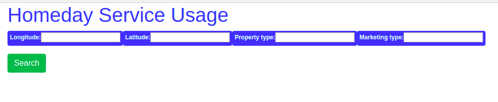
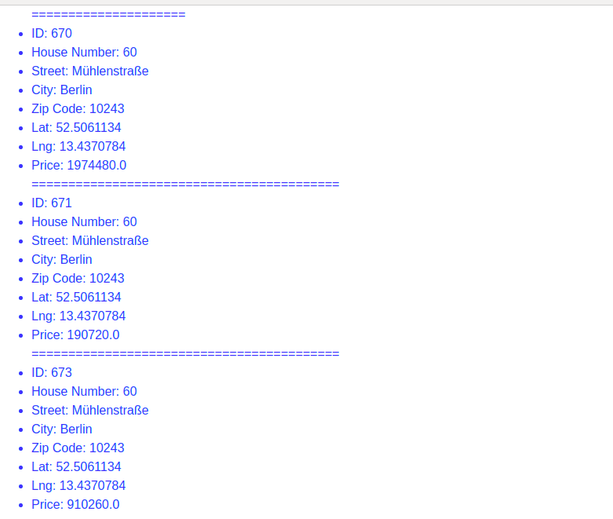

# Development Environment
 ```ruby '2.6.3'```
 ```Rails  6.0.1```
 ```PostgreSQL```

 ```sh
$ cd Service-Usage
$ bundle install
$ bundle exec rake db:create
$ bundle exec rake db:migrate
$ rails s -p 3001
```
# Home
 

# Successful response
 
 
# Bad Request
 